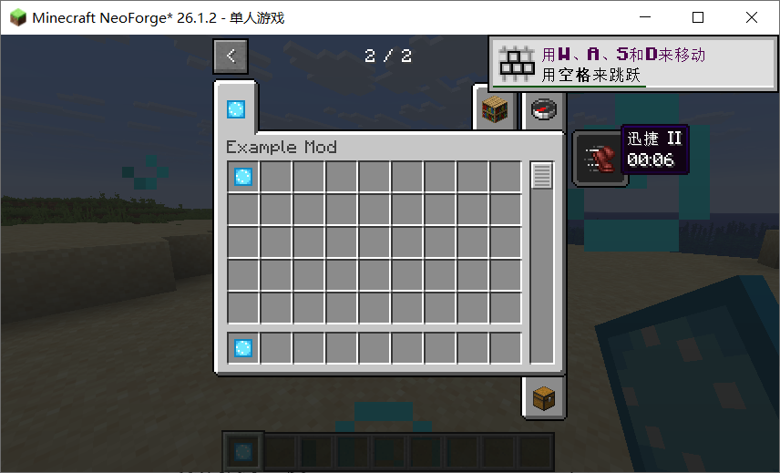
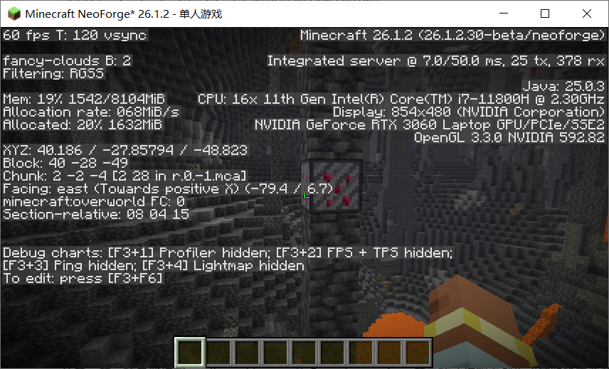

# NeoForge Mod Agent

NeoForge Mod Agent 是一个面向 `minecraft.neoforge` 的领域受控 Coding Agent。它先把自然语言需求约束为 `ModSpec`，再由确定性生成器产出 Java、JSON 和资源文件；LLM 只参与规划、工具选择与结构化修复，不能绕过 audit / Gradle build gate。

项目关注的是生成过程可检查、失败后可修复、结果可复验，而不是让模型自由修改整个工程。

```text
Natural language
→ ModSpec-first planner
→ deterministic NeoForge generator
→ controlled tools + structured patch
→ audit / Gradle build gate
→ trace-backed, replayable evidence
```

## Verified Evidence Snapshot

| 验证层 | 已公开结果 | 严格边界 |
| --- | --- | --- |
| Offline development E2E | mock + decomposed planner：2/2 success，audit 2/2，repeat modify 1/1 | 证明离线工程链路可复现，不证明真实 provider |
| Build showcase | 5 passed / 0 failed / 1 skipped（quality gate 未请求）；development E2E Gradle build 2/2 | 证明 generated workspace 可编译，不证明游戏内行为 |
| Manual Minecraft runtime | 4/4 checked，4 passed，0 failed / blocked / unverified | 证明实际进入 NeoForge 客户端检查；包括 Y<0 深板岩层自然生成复验 |

- 脱敏冻结的 eval/build/real-provider 报告：[Portfolio Evidence](evidence/portfolio/README.md)
- Runtime checklist、JAR/截图 SHA-256 和逐项结果：[Minecraft Runtime Evidence](evidence/runtime/README.md)

部分历史 decomposed real-provider 指标目前缺少对应原始 run，因此不计入上表中的可复验主结果；详细边界见 [Real LLM Evidence Summary](docs/Agent与能力/real-llm-evidence-summary.md)。

## Minecraft Runtime Evidence

| Passed: Speed Crystal behavior | Passed: Deepslate worldgen revalidation |
| --- | --- |
|  |  |
| Speed Crystal 在 NeoForge 客户端中触发 Speed II；截图时剩余 6 秒，物品仍保留在快捷栏。 | 新 workspace 在 `Y≈-28` 的深板岩地形中观察到自然 Ruby Ore；configured feature 也在实心 Deepslate 环境中放置成功。 |

第三个 runtime case 保留了一次有价值的失败→诊断→复验链：最初在不满足矿石替换条件的位置执行 `/place feature`，Minecraft 返回放置失败；源码与 Stone-volume 对照实验确认这是验收前置条件问题，而不是 generator 注册缺陷。随后又补充了生存模式挖掘证据：Ruby Block 掉落自身，Ruby Ore 掉落 Ruby。原失败尝试没有被删除，而是与成功复验一起记录。

第四个 runtime case 来自该诊断发现的真实语义缺口：原 generator 的 `Y -64..32` 只生成 Stone target。修正后 configured feature 同时覆盖 `stone_ore_replaceables` 和 `deepslate_ore_replaceables`，并通过 audit、Gradle build、Deepslate configured-feature 放置与 `Y<0` 自然生成复验。

基础 Ruby 物品的客户端注册与自定义纹理证据：[held-ruby.png](evidence/runtime/attachments/runtime_basic_ruby/held-ruby.png)。

## Core Capabilities

- **ModSpec-first generation**：自然语言先进入领域规格；item、block、ore/worldgen、recipe、machine、entity、progression、quest guide 和资源能力由确定性 generator 落地。
- **Controlled repair/refine**：LLM 只能调用检索、文件读取、结构化 patch、audit 和 build 等受控工具，不能输出无边界 diff。
- **Safe patch execution**：workspace 路径策略、patch 前 snapshot、失败 rollback、structured patch report 和残余风险记录共同限制写入范围。
- **Evidence-backed validation**：每次运行可以产生 planner、prompt、tool-call、RAG citation、reviewer、audit/build、patch 和 replay evidence。
- **Reliability evaluation**：eval、repair suite、RAG ablation、benchmark 和 runtime evidence 分层记录成功、失败与验证边界。

完整领域能力见 [ModSpec](docs/规格与生成/modspec.md) 和 [Capabilities](docs/总览/capabilities.md)。

## Quick Start

PowerShell：

```powershell
$env:PYTHONPATH = (Resolve-Path .\src)

# Check the local environment
py -3.11 -m agent.cli doctor --no-java --json

# Reproducible offline development E2E
py -3.11 -m agent.cli eval `
  --cases examples/agent_development_e2e.json `
  --planner decomposed `
  --llm-provider mock `
  --audit `
  --no-build `
  --json

# Run regression tests
py -3.11 -m unittest discover -s tests -v
```

需要 Gradle 编译证据时运行：

```powershell
py -3.11 -m agent.cli showcase `
  --run-name public-build-smoke `
  --llm-provider mock `
  --build `
  --json
```

`--no-build` 只证明 audit-level 流程；`--build` 证明 workspace 可编译；只有显式 runtime evidence 才能证明实际进入 Minecraft 检查。真实 provider 运行还应使用 `--require-llm` / `--require-real`，避免把 fallback 成功计入模型成功。

更多 develop、repair、benchmark 和 RAG ablation 命令见 [Showcase Guide](docs/发布与展示/showcase.md)。

## Component Responsibilities

| Component | 可以做什么 | 不能替代什么 |
| --- | --- | --- |
| LLM planner | 把自然语言整理为 feature plan / `ModSpec` | 不能直接自由修改项目源码 |
| LLM tool loop | 选择受控读取、检索、patch、audit/build action | 不能绕过路径策略或提交任意 diff |
| Deterministic generator | 根据 `ModSpec` 生成 Java、JSON、resources 和 PNG | 不负责猜测开放式需求 |
| Structured patch executor | 校验路径、snapshot、应用 patch、记录 rollback | 不能写到 generated workspace 的允许范围之外 |
| LLM reviewer | 审查需求覆盖、风险和 evidence sufficiency | 不能把 audit/build failure 改成 success |
| Audit / Gradle build | 提供确定性的 workspace 结构与编译 gate | 不等于 Minecraft 客户端/服务端 runtime 验收 |
| Manual runtime evidence | 记录实际游戏内检查、截图和失败现象 | 不自动代表所有 Mod 行为均已覆盖 |

核心原则是：LLM 提供受约束的决策，确定性代码负责生成、执行边界和最终工程门禁。

## Evidence And Safety

- `.agent/` 保存 planner、prompt、tool-call、RAG、reviewer、audit/build、patch 和 rollback evidence。
- `workspace/` 是 generated artifacts 和本地 evidence 区，不作为长期源码资产。
- `evidence/portfolio/` 保存经过脱敏和 SHA-256 校验的公开冻结报告。
- `evidence/runtime/` 保存人工 Minecraft runtime checklist、被测 JAR hash 和截图附件。
- Mock、real provider、fallback、audit、build 和 runtime 结果分层统计，不相互冒充。
- Direct Code Lane 是实验性受控通道，不能绕过 ModSpec、structured patch 和 gate。

## Repository Layout

```text
src/neoforge_agent/      Agent runtime, planner, generator, auditor, repair, benchmark
src/agent/               CLI compatibility entrypoint
examples/                ModSpec examples, eval suites, repair/RAG benchmark cases
templates/neoforge-26.1/ NeoForge workspace template
tests/                   Unit, regression, safety and evidence tests
docs/                    Architecture, contracts, validation and showcase documentation
evidence/portfolio/      Sanitized frozen eval/build/provider reports
evidence/runtime/        Manual Minecraft runtime evidence and screenshots
workspace/               Local generated workspaces; not a long-term source directory
```

## Documentation

- [Architecture](docs/总览/architecture.md)
- [Agent Workflow](docs/Agent与能力/agent-workflow.md)
- [Tool Calling Contract](docs/Agent与能力/tool-calling-contract.md)
- [ModSpec](docs/规格与生成/modspec.md)
- [Validation And Reliability](docs/验证与可靠性/README.md)
- [Runtime Manual Validation](docs/验证与可靠性/runtime-manual-validation.md)
- [Showcase Guide](docs/发布与展示/showcase.md)
- [Public Release Checklist](docs/发布与展示/public-release-checklist.md)

## Project Boundaries

- 稳定 domain 只有 `minecraft.neoforge`，不是通用无限制 Coding Agent。
- RAG 是 planner / repair / reviewer 的上下文和 citation evidence，不是项目主线。
- Reviewer 只能做覆盖、风险和证据审查，不能替代 audit/build gate。
- Build 通过只证明 workspace 可编译，不自动证明游戏内交互、平衡性、AI 行为或玩家体验。
- 所有公开结论必须能够由测试、report、trace、build log 或 runtime evidence 支撑。
