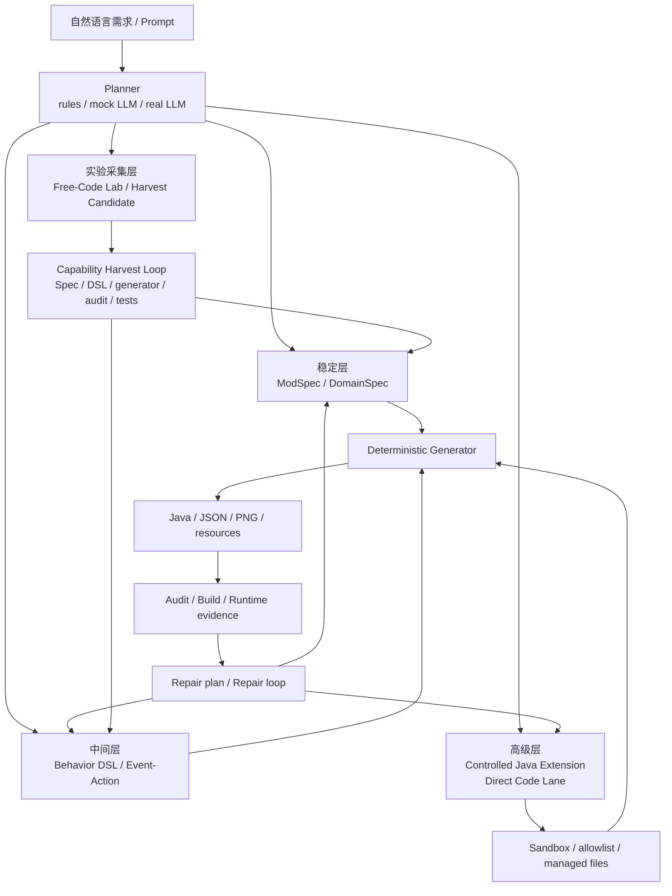

# LLM 三层能力架构

> 文档定位：这是 LLM 能力分层补充材料，不是主学习入口。详细机制以 [direct-code-lane.md](../Agent与能力/direct-code-lane.md) 和 [capability-harvest-loop.md](../Agent与能力/capability-harvest-loop.md) 为准。

这份文档用于回答一个简历和面试里很容易被追问的问题：如果 LLM 只是生成 `ModSpec`，项目会不会太简单？

答案是：项目不应该被描述成“LLM 只写一个 JSON”。更准确的架构是“受控生成 + 实验采集”两段式：稳定路径里，LLM 负责高层决策、行为编排、失败诊断和受控扩展意图，确定性系统负责把通过验证的意图落地为可复现工程产物；当稳定 generate 表达不足时，Free-Code Lab 才在隔离 workspace 里探索，成功样本再沉淀回稳定 generator。

## 总览



## 第一层：稳定规格生成

稳定层适合结构化内容：

- items、blocks、ores、foods、tools、armor
- recipes、loot tables、tags、language、models、blockstates
- worldgen、dimensions、biomes、structures
- textures、resource quality report、atlas、preview

这一层的核心不是“模板套代码”，而是把 LLM 的输出收束成可校验 `ModSpec`。这样同一个 spec 可以稳定重放，audit 和 repair 也有明确的真相源。

推荐说法：

> 基础内容走规格生成：LLM 将自然语言需求转换为 `ModSpec`，validator 检查领域约束，确定性 generator 生成 Java/JSON/PNG，后续通过 audit/build/eval 验证。

## 第二层：Behavior DSL / Event-Action

中间层解决“LLM 参与感不足”的问题。这里不是只填物品字段，而是让 LLM 把玩法意图翻译成可组合规则：

```text
trigger -> conditions -> actions
```

当前已支持的方向已经从“物品/方块行为模板”扩成共享语义层：

- hosts：`item`、`block`、`machine`、`entity`、`progression`、`quest`
- compiled runtime：`item`、`block`、`sword`、`ore`
- report-only semantics：`machine`、`entity`、`progression`、`quest`
- combos：`any`、`all`、`sequence`，配合 `window_ticks`
- state/resource/cooldown/chain：状态字段、资源消耗/恢复、冷却检查、链式触发

生成产物里会有 `.agent/behavior-report.json` 和 `.agent/behavior-report.md`，记录 host 覆盖、触发器统计、compiled/report-only 分类，以及 combo/state/resource/chain 指标。

示例：

```powershell
py -3.11 -m agent.cli generate-from-spec .\examples\behavior_dsl_battle_charm.json --workspace-name behavior-layer-demo --overwrite --audit --no-build --json
```

这个示例会生成一个 Battle Charm 和 Ruby Pedestal：右键回血、再生效果、粒子、音效，以及背包 tick 条件触发粒子；同时写出 shared behavior report。

推荐说法：

> 中等复杂度行为不让 LLM 直接写 Java，而是先转成 Event-Action DSL。DSL 仍然可审计，但已经能表达右键、攻击、tick、机器事件、实体事件、任务线事件、组合触发、状态、资源消耗和链式效果，比单纯 `ModSpec` 字段更接近玩法逻辑。

## 第三层：受控 Java 扩展、Direct Code Lane 与 Patch Agent

高级层用于回应“为什么不像 MiniCode / pi-mono 一样让 LLM 直接改代码”。这里的方向不是裸奔式开放整个 repo，而是受控开放：

当前已落地的是 V6.1 `java_extension`：

- 只能生成 additive class
- 只能写入 `src/main/java/<package>/extension/<ClassName>.java`
- 不允许编辑现有生成类、Gradle、网络、文件、进程、反射、线程、native、unsafe API
- import 使用 allowlist
- 生成 `.agent/java-extension-report.*`、diff 和 rollback 报告

V6.2 开始，modify 链路可以显式进入受控 patch-agent：

- LLM 先输出 patch plan，而不是直接改仓库
- 只允许修改 managed files，默认仍然是生成出来的 Java / resources / `.agent`
- patch plan 会记录 before/after ModSpec、增删改跳过、managed roots、audit/build/rollback 门槛
- 最终 report 会记录 audit / build / repair 结果，以及 rollback 是否建议执行

示例：

```powershell
py -3.11 -m agent.cli generate-from-spec .\examples\controlled_java_extension.json --workspace-name controlled-extension-demo --overwrite --audit --no-build --json
```

modify 示例：

```powershell
py -3.11 -m agent.cli modify .\workspace\demo --planner llm --llm-provider mock --json
```

当前 modify 链已经实现受控 Code Patch Agent：

- LLM 先输出 patch plan，不直接改文件
- 只允许修改 managed files 或 extension package
- patch 必须经过 sandbox allowlist
- 自动运行 audit/compile/build gate
- 失败时生成 rollback plan 或进入 repair-loop

推荐说法：

> 通用 Coding Agent 让 LLM 通过工具直接改任意代码；本项目选择领域约束下的受控 patch。当前已经有 Java Extension 沙箱、managed-file patch-agent 和 Direct Code Lane，仍然保留领域边界、审计和回滚能力。

## 第四层：Free-Code Lab / Capability Harvest Loop

V8.5 之后多了一层“实验采集”，它不是稳定 generate 主路径，也不是让 LLM 自由改仓库：

```text
generate gap
-> Free-Code Lab copied workspace
-> structured free-code patch
-> audit / build / manual runtime checklist
-> harvest candidate
-> later ModSpec / DSL / generator / audit / repair / test upgrade
```

Free-Code Lab 的价值是让 LLM 在 generate 覆盖不了的地方先探索，保留成功样本和失败原因。真正进入主项目时，不能直接复制实验代码，而要整理成确定性 generator 模板和回归测试。

推荐说法：

> Direct Code Lane 解决单次 agent run 的表达上限；Free-Code Lab 解决“如何从 LLM 探索中学习”。实验成功后，项目不是依赖模型下次再自由发挥，而是把模式固化进 `ModSpec`、DSL、generator、audit 和 tests。

## 和 MiniCode / pi-mono 的差别

| 维度 | 通用 Coding Agent | 本项目三层架构 |
| --- | --- | --- |
| 目标 | 任意代码库探索、编辑、运行命令 | NeoForge 领域内稳定生成、审计、修复 |
| LLM 权限 | 通过工具直接读写代码 | 输出 spec、DSL、repair plan、受控 extension/patch；实验区只写 copied workspace |
| 强项 | 通用性、自由度、像真实编程助手 | 可复现、可审计、可量化、领域正确性、能把成功实验沉淀回 generator |
| 风险 | 上下文漂移、误改、权限和回滚复杂 | 模板/DSL 边界限制 |
| 最佳解释 | Coding Agent harness | Domain-bounded codegen agent |

## 面试压缩版

可以这样讲：

> 我的项目不是让 LLM 随便写 Java，而是做了受控生成和能力采集两套闭环。基础内容用 `ModSpec` 保证稳定，复杂玩法用 Behavior DSL 表达事件、条件和动作，更高级的 Java 能力走受控 extension、Direct Code Lane 或 patch 沙箱。稳定 generate 覆盖不了的需求进入 Free-Code Lab 实验，通过 audit/build/人工 checklist 后再 harvest 回 generator，所以它牺牲一部分通用性，换来可复现、可验证和可沉淀。

## 更新：ModSpec-first + Direct Code Lane

最新口径不再是“LLM 只能输出 ModSpec”。更准确的说法是：

```text
LLM 默认输出 ModSpec / DSL / controlled extension intent；
当需求超出 ModSpec 表达能力时，可以输出结构化 Direct Code Patch；
系统负责 review、snapshot、apply、audit、build、rollback evidence。
```

Direct Code Lane 仍然不是通用 Coding Agent。它不接受自由 diff，不允许越过生成 workspace，不允许修改工具项目源码，也不会在第一版里自动进行 Direct Code repair-loop。项目不足和后续路线见 [project-limitations.md](../总览/project-limitations.md)。

## 更新：Capability Harvest Loop

最新后续主线是：

```text
需求超出 generate 能力
-> Free-Code Lab 实验生成
-> audit / build / 人工 runtime checklist
-> harvest candidate
-> 稳定 generator 升级
-> regression tests
```

这条路线的重点不是让 LLM 权限越来越大，而是让项目能把 LLM 成功探索过的模式沉淀为确定性能力。第一批固化目标是高级 machine GUI / BlockEntity。
