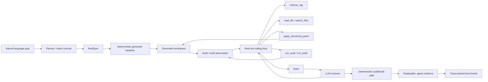

# RC1 Architecture

> 这是当前整体架构真相源。项目是受控 NeoForge Minecraft Mod Coding Agent，不是普通一次性 generator，也不是通用无限制 coding agent。

## 总体链路



## 运行层

- `AgentRuntime` 负责 planner、reviewer、executor、auditor、repair 和 trace 持久化的通用骨架。
- `NeoForge` domain plugin 负责 `minecraft.neoforge` 的 `ModSpec`、generator、audit、repair 和 build 检查。
- `ToolCallingRepairAgent` 是 develop/refine/repair 共用的 workspace tool loop。
- `LLMReviewer` 审查目标覆盖、unsupported request、patch 风险和残余风险。
- `AgentBenchmarkRunner` 运行真实 agent 流程，并从 trace 计算指标。

## 数据边界

```text
LLM
-> structured planner output / reviewer JSON / tool action
-> deterministic executor or controlled patch executor
-> audit/build/reviewer observation
-> next LLM turn
```

LLM 不能直接写完整项目，也不能修改仓库源码。所有文件写入都通过 generator 或 `apply_structured_patch`，并受 workspace path safety、snapshot 和 rollback evidence 限制。

## Evidence

核心 evidence 位于 generated workspace 的 `.agent/`：

```text
agent-run.json
prompt-trace.json
tool-call-trace.json
rag-context.json
reviewer-report.json
audit-report.json
repair-loop-report.json
structured-patch-report.json
structured-patch-rollback-report.json
```

benchmark evidence 位于 `workspace/agent-benchmark-runs/<run-id>/.agent/`，并链接每个真实 case 的 trace、reviewer report 和 agent-run payload。

## 当前稳定 domain

`minecraft.neoforge` 是当前稳定 domain。其它 domain 只能作为架构扩展槽位讲解，不能当作已完成生产能力展示。
