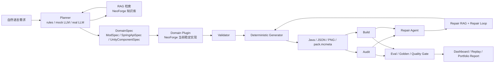
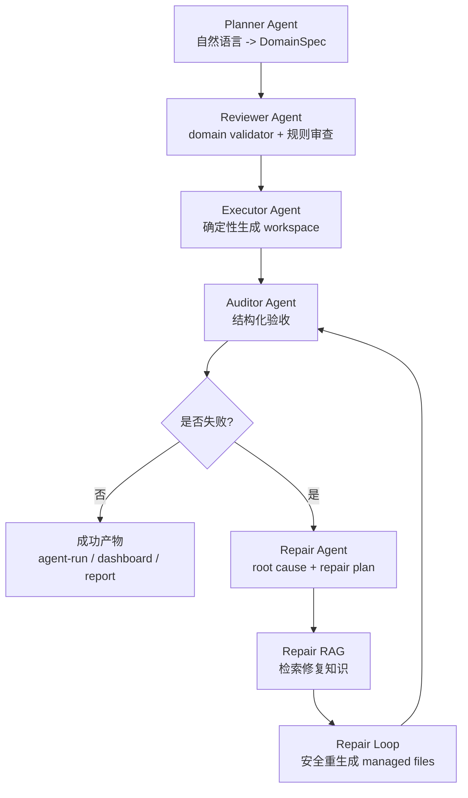
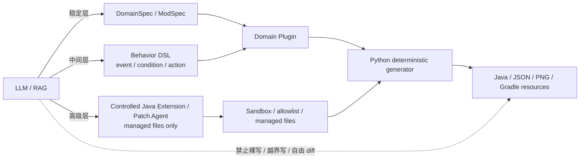
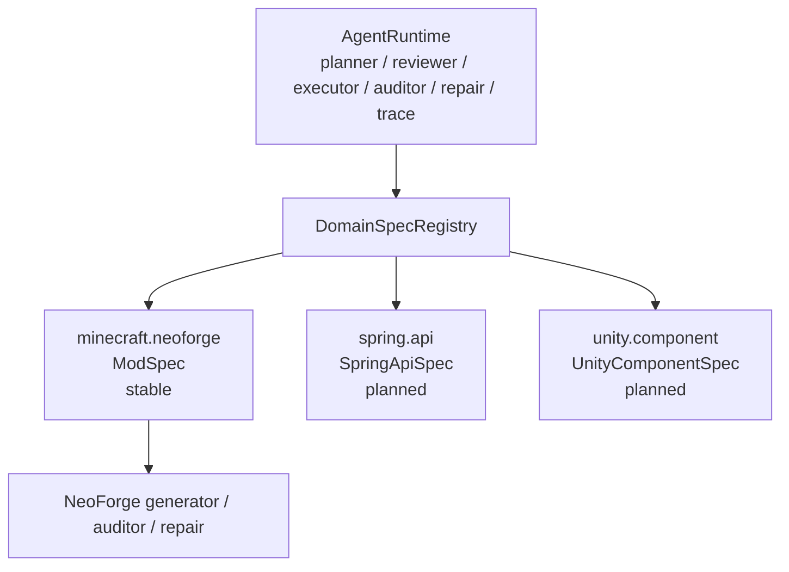
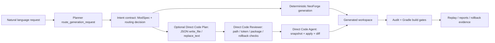
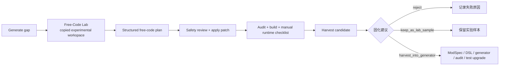

# 架构图

> 文档定位：这是整体架构真相源。项目分层、数据流、DomainSpec / NeoForge plugin 边界以本文为准。

## 总体链路



## 多 Agent 分工



## 关键边界



更完整的三层解释见 [`docs/Agent与能力/llm-capability-layers-cn.md`](../Agent与能力/llm-capability-layers-cn.md)。

## 产物目录

```text
workspace/<name>/
  .agent/
    modspec.json
    generation-summary.json
    audit-report.json
    agent-run.json
    agent-decisions.md
    prompt-trace.json
    llm-stability.json
    rag-context.json
    repair-loop-report.json
    direct-code-plan.json
    direct-code-report.json
    harvest-candidate.json
  src/main/java/
  src/main/resources/
```

## DomainSpec 插件边界



## Direct Code Lane Architecture Addendum

The current architecture is a `ModSpec-first hybrid agent`, not a ModSpec-only generator. The default route still prefers `ModSpec`, Behavior DSL, and controlled extension intent. When the request is outside ModSpec expression, `agent generate` and `agent modify` can enter Direct Code Lane.



Direct Code Lane does not accept free-form diffs, cannot modify this tool project, and cannot touch `.git`, Gradle wrapper jars, build outputs, or paths outside the generated workspace. Known gaps are tracked in [project-limitations.md](../总览/project-limitations.md).

当前只有 `minecraft.neoforge` 是稳定实现；`spring.api` 和 `unity.component` 是规划中的插件槽位，用来证明 runtime 和 spec 边界已经抽开。

## 2026-05-29 Capability Harvest Addendum

当前后续主线是 `Capability Harvest Loop`。它不是让 Direct Code Lane 继续膨胀成通用 coding agent，而是把“generate 覆盖不了的需求”放进隔离实验区，经过自动检查和人工 runtime checklist 后，再把成功模式沉淀回稳定 generator。



Free-Code Lab 只写 `workspace/free-code-lab-runs/<run-name>/` 下的实验副本，不修改原 workspace，也不修改本工具源码。汇总入口是：

```powershell
py -3.11 -m agent.cli agent lab-generate "<request>" --from-workspace <workspace> --run-name <name> --build --json
py -3.11 -m agent.cli harvest-report --run-name <name> --json
```

详细边界见 [capability-harvest-loop.md](../Agent与能力/capability-harvest-loop.md)。
