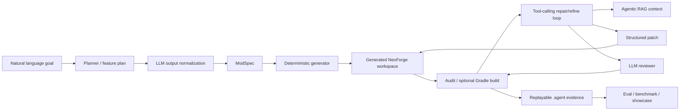

# Current Architecture

> 这是当前整体架构真相源。项目是面向 `minecraft.neoforge` 的受控 Minecraft Mod Coding Agent，不是一次性模板 generator、通用 RAG 应用、聊天机器人，也不是无限制自由 Coding Agent。

## 主线链路



稳定能力必须服务这条链路：

```text
Natural language
-> ModSpec-first planner
-> deterministic generator
-> real tool-calling repair/refine loop
-> structured patch + evidence
-> LLM reviewer
-> audit/build gate
-> trace-backed showcase / benchmark
-> replayable .agent evidence
```

## 核心模块

- `ModProjectPlanner` 和 LLM planner：把自然语言或文件输入解析为 `ModSpec`，失败和 fallback 策略留在 planner/orchestrator/CLI 边界。
- `PlannerResolution`：命名成功规划结果，包含 `spec`、`artifacts`、`warnings` 和 `planner_mode_used`。
- `LLMNormalizationResult`：命名 LLM planner/patch JSON 归一化结果，输出 `normalized_json` 和 `warnings`，不改变 ModSpec JSON shape。
- `ProjectGenerator`、`WorkspaceMaterializer` 和各类 `*_generator.py`：把 ModSpec 转成 NeoForge Java、JSON、resources、PNG 和 `.agent` evidence。
- `AgentRuntime` 与 NeoForge runtime plugin：承载 generate/develop/modify/repair 的 stage 编排，并把 domain plugin 边界与 workflow port 分开。
- `ToolCallingRepairAgent`：执行受控 tool loop，包括检索、读文件、结构化 patch、audit/build 和 finish。
- `LLMReviewer`：审查覆盖、风险和 evidence sufficiency，但不能替代 validator、audit 或 build gate。
- `AgentEvidenceWriter` 与报告生成器：记录 planner、repair、reviewer、patch、benchmark 和 replay evidence。

## 领域边界

当前稳定 domain 是 `minecraft.neoforge`。其它 domain 只能作为 `DomainSpec` 架构扩展槽位讲解，不能当作已经稳定支持的生产能力展示。

RAG 是 planner、repair、reviewer 的上下文增强和 citation evidence，不是项目主线。RAG 成功不能替代 deterministic generator、validator、audit/build gate 或测试。

Direct Code Lane 是辅助或实验通道：

- Direct Code Lane 只接受结构化 workspace patch，并受 path policy、review、snapshot、audit/build 和 rollback evidence 限制。
- 成功补丁模式必须沉淀回 ModSpec、DSL、generator、audit 和 tests 后，才算稳定能力。

## Evidence 边界

核心 evidence 写在 generated workspace 的 `.agent/` 下，常见文件包括：

```text
modspec.json
agent-run.json
agent-decisions.md
prompt-trace.json
tool-call-trace.json
rag-decision-trace.json
reviewer-report.json
audit-report.json
repair-loop-report.json
structured-patch-report.json
structured-patch-rollback-report.json
```

Benchmark 和 evidence-chain 报告只证明 workspace 级 planner/generator/audit/build/repair 证据。除非报告显式列出人工 Minecraft runtime evidence，否则不能写成 Minecraft 客户端或服务端进游戏验收通过。

Mock provider 成功只能证明离线可复现流程通过；真实 provider 成功必须以实际 provider run、`--require-llm` 或 `--require-real` evidence 为准。

## 架构决策记录

- [ADR 0001](../adr/0001-adopt-feature-kind-catalog-without-changing-modspec-shape.md)：采用 Feature Kind Catalog，同时保持 ModSpec JSON shape。
- [ADR 0002](../adr/0002-name-generate-planner-resolution.md)：命名 `PlannerResolution`。
- [ADR 0003](../adr/0003-name-llm-normalization-result.md)：命名 `LLMNormalizationResult`，并收窄 decomposed planner 对 normalizer 的依赖。

架构候选状态和下一步排序见 [architecture-candidates-cn.md](architecture-candidates-cn.md)。

## 当前下一步

短期优先级不再继续拆 Agent Runtime、Direct Code Lane 或 runtime evidence 小 phase。Free-Code Lab 不再作为公开推荐能力；后续只需单独评估是否物理删除 legacy 源码和兼容 CLI。

1. 保留 `ModSpec-first + deterministic generator + audit/build + evidence` 作为唯一稳定主线。
2. Direct Code Lane 继续保持 experimental opt-in，不能包装成通用 coding agent。
3. Free-Code Lab 相关源码、CLI 和历史 evidence 如需删除，另开小候选处理。
